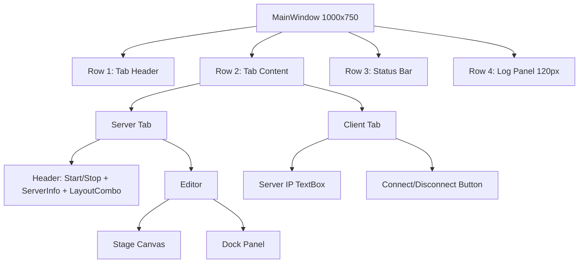
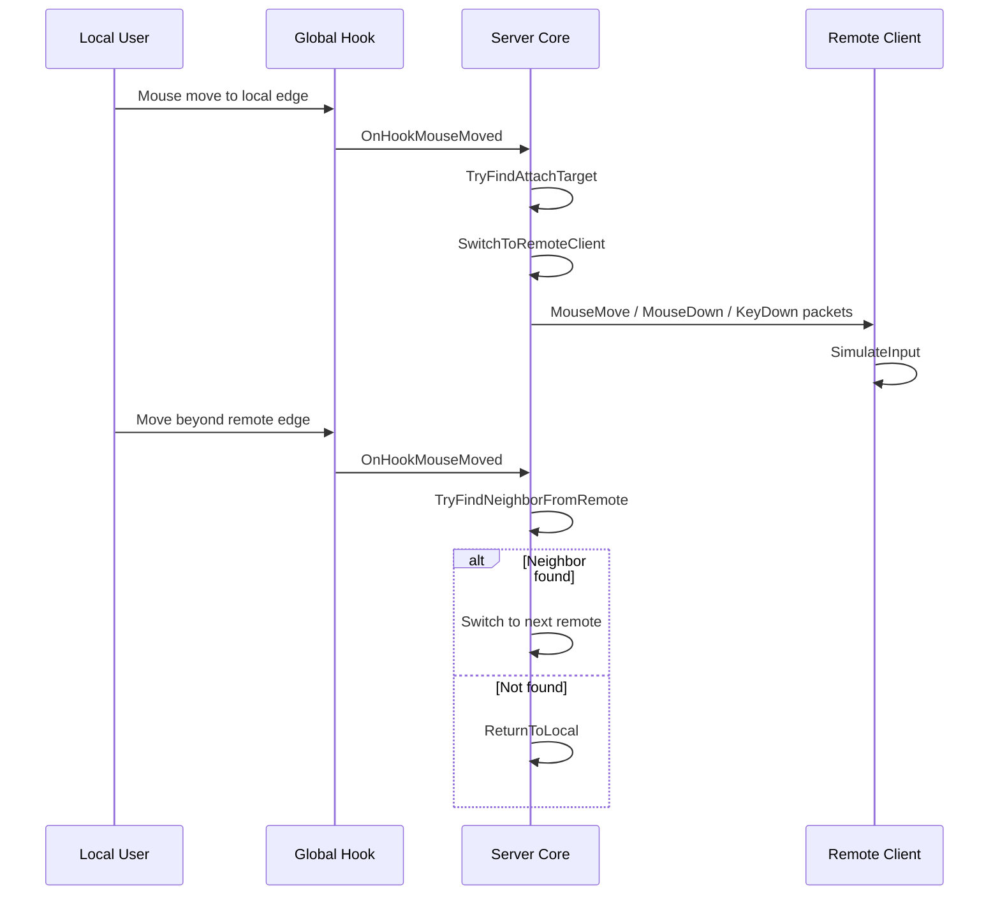

# SharpKVM 상세 명세서 (코드베이스 기준)

문서 버전: 1.3  
작성일: 2026-02-14  
코드 기준: `App/Program.cs`, `UI/MainWindow.cs`, `SharpKVM.csproj`, `SharpKVM.sln`

## Agent Quick Start
- Repository-level guide: `AGENTS.md`
- Primary behavior spec: `docs/SharpKVM_상세명세서.md`
- UI layout (window): `docs/images/ui-layout-main.svg`
- UI layout (stage/dock/snap/free): `docs/images/ui-layout-stage.svg`

에이전트 작업 원칙:
1. 기능/동작 설명 요청 시 이 문서를 우선 참조한다.
2. UI 구조 설명 시 두 개의 SVG 레이아웃 파일을 함께 참조한다.
3. 코드와 문서가 불일치하면 코드를 기준으로 판단하고, 같은 작업에서 문서를 갱신한다.
4. 결과물에는 참조한 파일 경로를 명시한다.

## 1. 문서 목적
이 문서는 SharpKVM의 현재 구현 코드를 기준으로 기능/구조/동작을 명세화한다.  
요구사항 문서가 아닌, 실제 구현된 동작(As-Is) 명세를 목표로 한다.

## 2. 시스템 개요
SharpKVM은 단일 실행 파일 기반의 데스크톱 KVM 애플리케이션으로, 하나의 바이너리에서 서버/클라이언트 모드를 모두 지원한다.

- 서버 역할: 원격 클라이언트 연결 수락, 전역 입력 가로채기, 원격 입력 전송, 레이아웃 관리
- 클라이언트 역할: 입력 패킷 수신 후 로컬 OS 입력 시뮬레이션, 클립보드 동기화
- 통신 방식: TCP 소켓 직렬 패킷 + payload (텍스트/파일/이미지)

## 3. 기술 스택
- 런타임: .NET 8 (`net8.0`)
- UI: Avalonia 11.0.6 (Desktop + Fluent Theme)
- 입력 훅/시뮬레이션: SharpHook 5.3.0
- 대상 앱 타입: `WinExe`

## 4. 실행/운영 모드

### 4.1 기본 모드
실행 후 UI를 통해 수동으로 서버 시작 또는 클라이언트 연결을 수행한다.

### 4.2 CLI 인자
다음 인자를 통해 자동 클라이언트 접속을 지원한다.

- `client <ip>`
- `--client <ip>`
- `-c <ip>`
- `--client=<ip>`

보조적으로 아래 인자에서 서버 IP 값을 읽어 `_autoServerIP`에 반영한다.

- `--server <ip>`
- `-s <ip>`
- `--server=<ip>`

## 5. 화면(UI) 명세

### 5.1 Main Window
- 제목: `SharpKVM (v7.7)`
- 기본 크기: `1000 x 750`
- 구성:
1. 상단(자동 높이): 탭 헤더
2. 중앙(가변): 탭 콘텐츠
3. 하단 상태 바(자동 높이): 상태 텍스트
4. 최하단 고정 로그 영역(120px): 로그 TextBox

### 5.2 탭 구성

#### Server 탭
- `Start Server` / `Stop Server` 토글 버튼
- (Debug 빌드 전용) `Add Virtual Client` 버튼: 루프백(`127.0.0.1`) 가상 클라이언트 1대 연결
- (Debug 빌드 전용) `Virtual Resolution` 콤보박스: 프리셋 해상도 선택
- 서버 상태/주소 Text (`IP: <addr> / Port: 11000`)
- `Layout` 콤보박스: `Snap`, `Free`
- 배치 편집 영역:
- Stage(Canvas): 로컬 스크린 + 배치된 클라이언트 시각화
- Dock(StackPanel): 미배치 클라이언트 목록

#### Client 탭
- 서버 IP 입력 텍스트 박스
- `Connect` / `Disconnect` 버튼

### 5.3 로그/상태
- 로그 출력 형식: `[mm:ss] message`
- 상태 텍스트 기본값: `Ready`

## 6. 네트워크/프로토콜 명세

### 6.1 기본 통신
- 프로토콜: TCP
- 포트: `11000`
- 서버 바인딩: `IPAddress.Any`
- Nagle 비활성화: `TcpClient.NoDelay = true`

### 6.2 패킷 구조
`InputPacket` (Pack=1)
- `Type: byte` (`PacketType`)
- `X: int`
- `Y: int`
- `KeyCode: int`
- `ClickCount: int`

### 6.3 패킷 타입
- `Hello(0)`: 클라이언트 해상도 전달
- `MouseMove(1)`
- `MouseDown(2)`
- `MouseUp(3)`
- `KeyDown(4)`
- `KeyUp(5)`
- `MouseWheel(6)`
- `Clipboard(7)`
- `ClipboardFile(8)`
- `ClipboardImage(9)`
- `PlatformInfo(10)`

### 6.4 핸드셰이크
1. 클라이언트 접속
2. 클라이언트가 `Hello` 전송 (`X=width`, `Y=height`)
3. 클라이언트가 `PlatformInfo` 전송 (`KeyCode=1`이면 macOS)
4. 서버가 handshake 성공 시 클라이언트 등록 및 UI 도크 반영

## 7. 서버 모드 기능 명세

### 7.1 시작 시 초기화
- TCP Listener 시작
- 로컬 IPv4 탐색 및 UI 표시
- 글로벌 훅 등록
- 마우스 전송 루프 시작 (`Task.Delay(5)`, 최대 약 200Hz)
- 비동기 클라이언트 수락 루프 시작

### 7.2 종료 시 정리
- 전송 루프 취소
- 훅 dispose
- 커서 상태 복원 (show/unlock)
- 모든 클라이언트 연결 종료
- UI 배치/도크 초기화
- 설정 저장

### 7.3 입력 훅 처리
- 훅 대상: MouseMove/Drag, MousePress/Release, MouseWheel, KeyPress/Release
- 원격 활성 상태에서 로컬 이벤트 suppress 처리
- 마우스 이동은 pending 좌표로 축적 후 전송 루프에서 송신
- 드래그 중에는 지연 없이 즉시 MouseMove 전송

### 7.4 디버그 가상 클라이언트
- 목적: 실장치 없이 서버 모드 동작 테스트
- 활성 조건: Debug 빌드에서만 버튼 노출
- 연결 방식: `TcpClient` 루프백 연결 후 `Hello`/`PlatformInfo` 패킷 전송
- 해상도: 프리셋 콤보박스 선택값 사용 (기본 `1920x1080`, 세션 동안 유지)
- 제한: 1대만 동시 실행 가능 (중복 시작 방지)
- 서버 종료 시 가상 클라이언트도 함께 종료

## 8. 클라이언트 모드 기능 명세

### 8.1 접속 루프
- 서버 IP로 접속 시도
- 실패 시 3초 간격 재시도
- 접속 성공 시 패킷 수신 루프 진입

### 8.2 수신 처리
- 입력 패킷: 로컬 OS 입력 시뮬레이션
- `Clipboard`: 텍스트 클립보드 반영
- `ClipboardFile`: zip payload 수신 후 파일 복원 및 클립보드 파일 객체 설정
- `ClipboardImage`: 이미지 바이트 수신 후 로컬 이미지 클립보드 반영

## 9. 입력 전환(KVM) 명세

### 9.1 로컬 → 원격 진입
- 로컬 커서가 로컬 스크린 외곽(edge) buffer 내 진입 시 전환 후보 탐색
- 배치된 클라이언트 중 anchor/오버랩 조건 만족 대상 선택
- 전환 성공 시:
- 원격 활성화
- 로컬 커서 중앙 고정 + 숨김
- 가상 좌표 `_virtualX/_virtualY` 초기화

### 9.2 원격 포인터 이동
- 실제 로컬 커서 중심점 대비 delta(dx,dy)를 가상 원격 좌표에 누적
- 해상도 비율(`_resolutionScale`) 및 감도 반영
- 특정 임계치(너무 큰 이동)면 스파이크로 간주해 중앙 재고정

### 9.3 원격 → 원격 / 원격 → 로컬 이탈
- 원격 가상 좌표가 클라이언트 경계 밖으로 나가면 이웃 클라이언트 탐색
- 이웃 존재 시 연쇄 전환
- 없으면 로컬 복귀 처리
- 로컬 복귀는 현재 원격 진입에 사용된 연결 경계에서만 허용
- Free 모드 복귀 시에는 원격 이탈점의 절대 경계 좌표를 로컬 경계에 매핑해 같은 접점에서 복귀
- Snap 모드 복귀는 기존 비율 기반 복귀 동작 유지

### 9.4 키보드 전송
- 원격 활성 시 `KeyDown/KeyUp` 패킷 전송
- 원격이 macOS인 경우 modifier 매핑 보정:
- `Meta ↔ Alt` 교환
- macOS 클라이언트는 입력 소스 단축키(`AppleSymbolicHotKeys` 60/61)를 주기 조회
- 수신한 키 조합이 현재 입력 소스 단축키와 일치하면 해당 동작을 mac에서 직접 실행
- `CapsLock` 전환은 mac 옵션 `Use the Caps Lock key to switch to and from ABC`가 반영된 상태에서만 허용

### 9.5 마우스 버튼/휠
- MouseDown/Up 시 clickCount 포함(더블클릭 감지)
- macOS Raw 이벤트 전송 시 `Button4/5`(앞/뒤 버튼)는 OtherButton 계열로 전송
- 휠은 누산기(`_wheelAccumulator`) 기반 정수 delta 생성 후 전송

## 10. 레이아웃 명세

### 10.1 좌표계
- Desktop 좌표: 실제 스크린/클라이언트 배치의 전역 좌표
- Stage 좌표: Canvas 표시 좌표
- `DesktopToStage`, `StageToDesktop` 변환 제공

### 10.2 Snap 모드
- 각 로컬 스크린의 `Left/Right/Top/Bottom` 슬롯 생성
- 클라이언트 박스를 슬롯 근접 드롭 시 스냅 배치
- 배치 정보에 `SnapAnchorID`, `AnchorEdge` 저장

### 10.3 Free 모드
- 자연 크기 기반 자유 드래그 배치
- 가장 가까운 글로벌 외곽 스크린 edge에 부착
- 자기/타 클라이언트/글로벌 경계 기준 마그네틱 스냅 적용

### 10.4 레이아웃 변경
- 콤보박스 전환 시 배치된 클라이언트 일괄 재배치
- Snap→Free: 중심점 기준 자유 배치 재계산
- Free→Snap: 가장 가까운 슬롯으로 재스냅

## 11. 클립보드 동기화 명세

### 11.1 폴링
- 2초 간격 타이머로 로컬 클립보드 점검

### 11.2 동기화 대상
- 텍스트
- 파일 목록
- 이미지

### 11.3 파일 전송
- 파일들을 메모리 zip으로 압축 후 `ClipboardFile`로 전송
- 수신 측은 `ReceivedFiles` 폴더 재생성 후 압축 해제

### 11.4 이미지 전송
- PNG 바이트 전송
- 수신 후 임시 파일 생성
- OS별 방식으로 이미지 클립보드 설정

### 11.5 루프 방지
- `_captured*`, `_sent*`, `_lastRecv*` 비교로 동일 데이터 재전파 방지

## 12. 플랫폼 특화 명세

### 12.1 Windows
- `user32.dll`:
- `ClipCursor`로 커서 잠금/해제
- 시스템 커서 숨김/복원
- 이미지 클립보드: PowerShell STA + WinForms Clipboard

### 12.2 macOS
- CoreGraphics 기반 Raw 이벤트:
- 클릭(`SendMacRawClick`), 이동(`SendMacRawMove`), 드래그(`SendMacRawDrag`)
- 클릭/드래그의 OtherButton 경로는 `Button3+`(예: Windows `Button4/5`)를 포함
- 커서 hide/show/warp
- `Ctrl + 방향키` 기반 Mission Control 스크립트 트리거 지원

## 13. 데이터 영속화 명세

### 13.1 `server_ip.txt`
- 마지막 서버 IP 저장
- 위치: `AppDomain.CurrentDomain.BaseDirectory`

### 13.2 `client_config.txt`
파이프(`|`) 구분 평문 저장:

`IP|Sensitivity|WheelSensitivity|LayoutMode|X|Y|Width|Height|IsPlaced|IsSnapped|SnapAnchorID|DesktopX|DesktopY|DesktopWidth|DesktopHeight`

저장 대상:
- 클라이언트별 감도
- 배치 여부/좌표
- 레이아웃 모드

## 14. 오류 처리/복구 명세
- 네트워크 예외 발생 시 클라이언트 루프는 자동 재시도(3초)
- 많은 구간이 `catch {}`로 무시 처리되어 사용자 로그 외 상세 원인 추적은 제한됨
- 클라이언트 연결 해제 이벤트에서 UI/레이아웃 동기 제거 수행

## 15. 보안/운영 제약
- 인증/암호화/TLS 부재 (평문 TCP)
- 신뢰 가능한 내부망 사용 전제
- 수신 파일은 자동 압축 해제되므로 운영 환경의 파일 신뢰 정책 필요

## 16. 성능 특성
- 마우스 이동 송신: 약 200Hz
- 클립보드 폴링: 2초
- 입력 지연 감소를 위해 NoDelay 사용 및 큐 기반 송신 처리

## 17. 알려진 구현 특성
- 코드가 책임별 파일로 분리됨 (`App`, `Core`, `Platform`, `Networking`, `UI`)
- 일부 주석 문자열 인코딩 깨짐 흔적 존재
- Linux 전용 분기/최적화는 사실상 없음 (Windows/macOS 중심)

## 부록 A. UI 레이아웃 다이어그램 (Mermaid)

## 부록 B. 입력 전환 시퀀스 (Mermaid)

